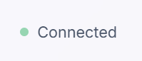

📱 RealTime Messenger - Professional Chat Application
A modern, real-time messaging application built with Socket.IO, featuring a sleek UI design and seamless communication capabilities. 

📸 Screenshots
Login Interface

Message Exchange

Message-box

Connection Status

Note: Add the screenshots folder to your repository with the above-named files.

✨ Features
Real-Time Messaging: Instant message delivery using Socket.IO

Professional UI: Modern glass-morphism design with gradient backgrounds

User Authentication: Token-based authentication system

Responsive Design: Works perfectly on desktop, tablet, and mobile devices

Message Validation: Client and server-side input validation

🛠️ Technology Stack
Frontend
HTML5 - Semantic markup

CSS3 - Modern styling with Flexbox and Grid

JavaScript (ES6+) - Client-side functionality

Socket.IO Client - Real-time communication

Font Awesome - Professional iconography

Google Fonts (Inter) - Clean typography

Backend
Node.js - Server runtime

Socket.IO - WebSocket communication

Express.js - Web framework (assumed)

📁 Project Structure
text
realtime-messenger/
├── public/
│   ├── index.html          # Main HTML file
│   ├── index.css           # Styling
│   ├── script.js           # Client-side JavaScript
│   └── images/
│       └── messgelogo.svg  # Logo asset
├── server/
│   └── server.js           # Backend server
├── screenshots/            # Repository screenshots
├── package.json
├── README.md
└── LICENSE
🚀 Quick Start
Prerequisites
Node.js (v14.x or higher)

npm or yarn package manager

Installation
Clone the repository

bash
git clone https://github.com/yourusername/realtime-messenger.git
cd realtime-messenger
Install dependencies

bash
npm install
# or
yarn install
Start the server

bash
npm start
# or
node server.js
Open your browser

text
Navigate to http://localhost:3000
Environment Setup
Create a .env file in the root directory:

text
PORT=3000
NODE_ENV=development
💻 Usage
Basic Setup
User Registration: Store username and token in localStorage

Connect: Application automatically connects to Socket.IO server

Send Messages: Enter recipient username and message content

Receive: Messages appear in real-time in the receiving panel

Code Example
javascript
// Connect to server
const socket = io();

// Register user
socket.emit('register', token);

// Send message
const messageData = {
    message: "Hello World!",
    recipientUserName: "john_doe",
    sender: currentUsername
};
socket.emit('chat-message', messageData);

// Receive messages
socket.on('private-message', (data) => {
    displayMessage(data.sender, data.message);
});
🎨 Design Features
Visual Elements
Glass-morphism UI with backdrop blur effects

Gradient backgrounds using modern CSS techniques

Smooth animations for enhanced user experience

Professional color palette suitable for academic presentation

UX Improvements
Input validation with real-time feedback

Loading states and error handling

Keyboard shortcuts for power users

Auto-scrolling message area

Responsive layout for all screen sizes